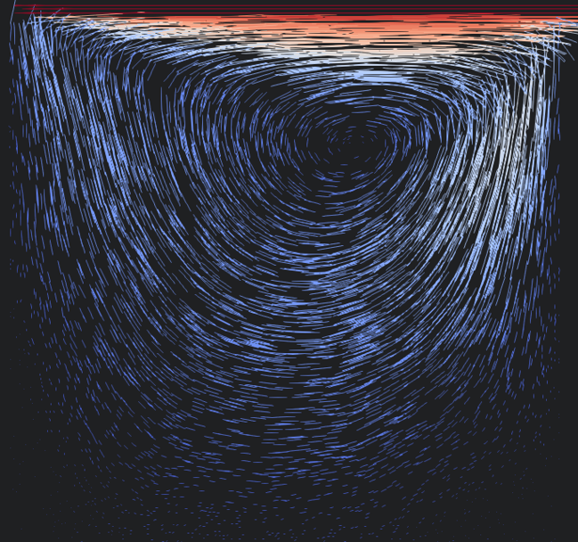

# Smoothed Particle Hydrodynamics Solver

This project implements the **Smoothed Particle Hydrodynamics (SPH)** approach in C++ using **OpenMP** for parallel execution.
Both Gaussian kernel and cubic spline kernel functions are available for the simulation.
The simulation results are formatted for visualization in **ParaView**.

## Usage

To run the simulations yourself, clone the repository and navigate to the project directory:
```bash
  git clone https://github.com/Daniel63656/SPH.git
  cd SPH
  ```
### Build the Project
This project uses **vcpkg** for dependency management. To build the project with all its dependencies, configure your
specific vcpkg installation to be used during build:
```bash
  cmake -B build -S . -DCMAKE_TOOLCHAIN_FILE=PATH_TO_YOUR_VCPKG_INSTALL/scripts/buildsystems/vcpkg.cmake
  cmake --build build
  ```
### Run a simulation:
```bash
  build\Debug\SPH.exe karmanVortex.txt
 ```
After the program terminates, simulation results can be found in the `out` folder.

## Simulation Results
### Lid Driven Cavity



### Karman Vortex Street

